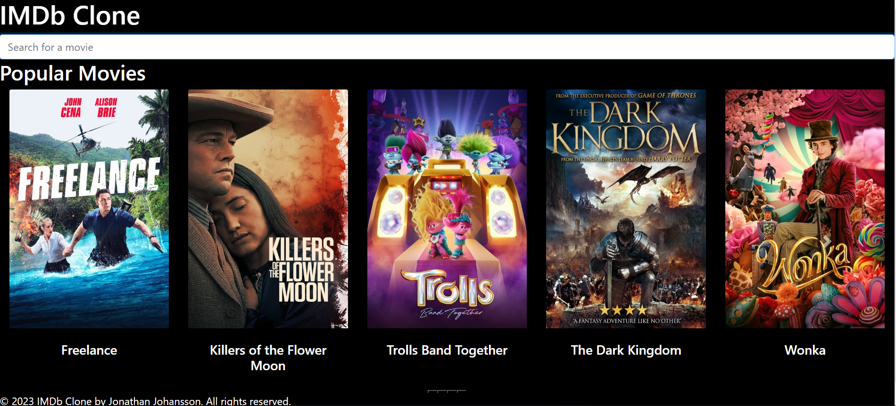

# IMDB Clone

Check out the live project [here](https://simbaimdbclone.netlify.app/).

## Overview

This project is a simple clone of IMDB, utilizing the MovieDB API. It's currently lightweight, only displaying popular movies. Movie details are displayed in a modal, rather than on a separate page.

## Features

- Display of popular movies
- Movie details in a modal

## Future Updates

This project is still under development. Future updates will include:

- More movie categories
- User reviews
- Movie ratings

## Built With

- The MovieDB API

## Contributing

Contributions are welcome! Please read the [contributing guide](CONTRIBUTING.md) to learn how you can contribute to the project.

## License

This project is licensed under the MIT License - see the [LICENSE](LICENSE.md) file for details.